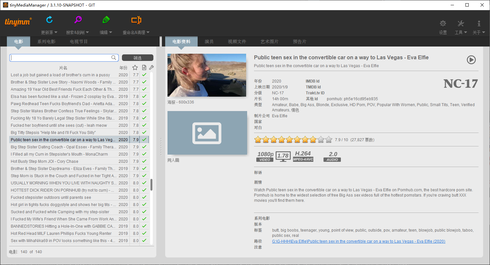

# [tinyPornManager][1]

tinyPornManager developed based on tinyMediaManager (https://www.tinymediamanager.org). Made for manage your porn videos from adult sites(eg: Pornhub).

## [Features][4]

- ~~Automatic updates~~
- GUI and command line interfaces
- Metadata scrapers for IMDb, TheMovieDb, TVDb, OFDb, Moviemeter, Trakt and more ( ***Pornhub*** ~~etc~~)
- Artwork downloaders for TheMovieDb, TVDb and FanArt.tv
- Trailer downloads from TheMovieDb and HD-Trailers.net
- Subtitles downloaded from OpenSubtitles.org
- Manually edit any metadata fields with ease
- Automatic file renaming according to any user-defined format
- Powerful search features with custom filters and sorting
- Saves everything in .nfo files automatically recognized by Kodi and most other media centers
- Technical metadata like codecs, duration and resolution extracted from each media file
- Group movies into sets with special artwork common to all movies in it
- Import TV show collections no matter the file organization style used

## [ToDo List][5]

- [x] Add a simple target website scraper to scrape the basic information of the video
- [ ] Scrape more information include better thumb-img and trailer, even actor profile 
- [ ] Refactor code to optimize performance and efficiency
- [ ] Docking more website
- [ ] Design a solution for the anti-crawler methods that the target website may use

## [Usage]

1. download latest [tinyPornManager][https://github.com/SoapCanFly/tinyPornManager/releases]
  > For the reason of identifying the uniqueness of your file, the file name should conform to a certain format.
  - **The _PORNHUB_ID_ part should be easy to locate(with regular expressions)**
  - "ph1234abcd.mp4"
  - "ph1234abcd-Super Hot Lily Potter.mp4"
  - "ph1234abcd Super Hot Lily Potter.mp4"
  - "[ph1234abcd]Super Hot Lily Potter.mp4"
3. download your favritate from website([Tampermonkey script for Pornhub][16])
4. open tinyPornManager > Settings > Movies > Data Sources, select your porn folder, close Settings window
5. click "Update sources" to load your resources  
6. click "Search & scrape" or submenu to began scraping
- For the file you just downloaded(new file), use "Search & scrape selected movies" or "Search & scrape selected movie(s)-force best match" or "Search & scrape all unscraped movie(s)-force best match"
- For the file that already scraped(old file), use "Scrape metadata for selected movie(s)"
- **Sometime website will delete video, and scraper will get a 404 repsonse**

## [Screenshots][13]



## Building from source

tinyPornManager is compiled using Apache's build automation tool, [Maven][15]. Check that you have it installed (and git, of course) before attempting a build.

1. Clone this repository to your computer

   ```bash
   git clone https://github.com/SoapCanFly/tinyPornManager.git
   ```

1. Build using maven

   ```bash
   mvn package
   ```

After that you will find the packaged build in the folder `dist`

[1]: https://www.tinymediamanager.org
[4]: https://www.tinymediamanager.org/features/
[5]: https://www.tinymediamanager.org/download/
[6]: https://www.tinymediamanager.org/download/prerelease
[7]: https://www.tinymediamanager.org/download/nightly-build
[8]: https://www.java.com/en/download/manual.jsp
[9]: https://openjdk.java.net/install/
[10]: /changelog.txt
[11]: https://www.tinymediamanager.org/blog/
[12]: https://www.tinymediamanager.org/changelog/
[13]: https://www.tinymediamanager.org/screenshots/
[14]: /CONTRIBUTING.md
[15]: https://maven.apache.org/
[16]: https://gist.github.com/SoapCanFly/530976648121f5725a1c45b5ad313cb7
